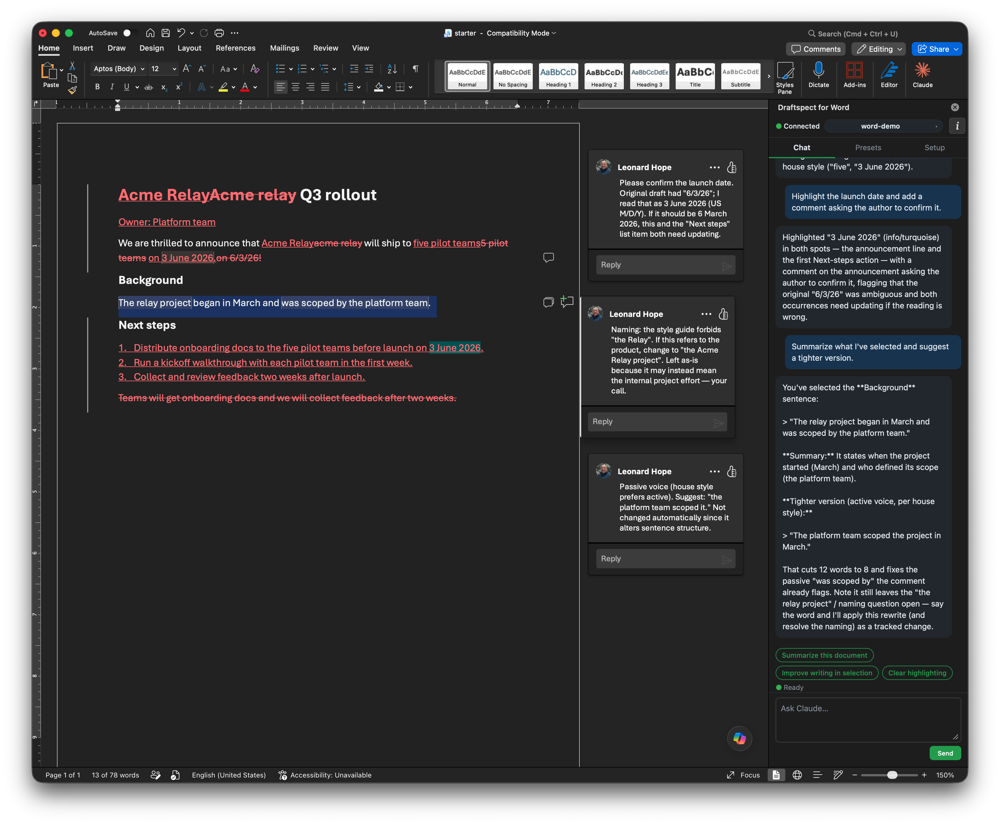
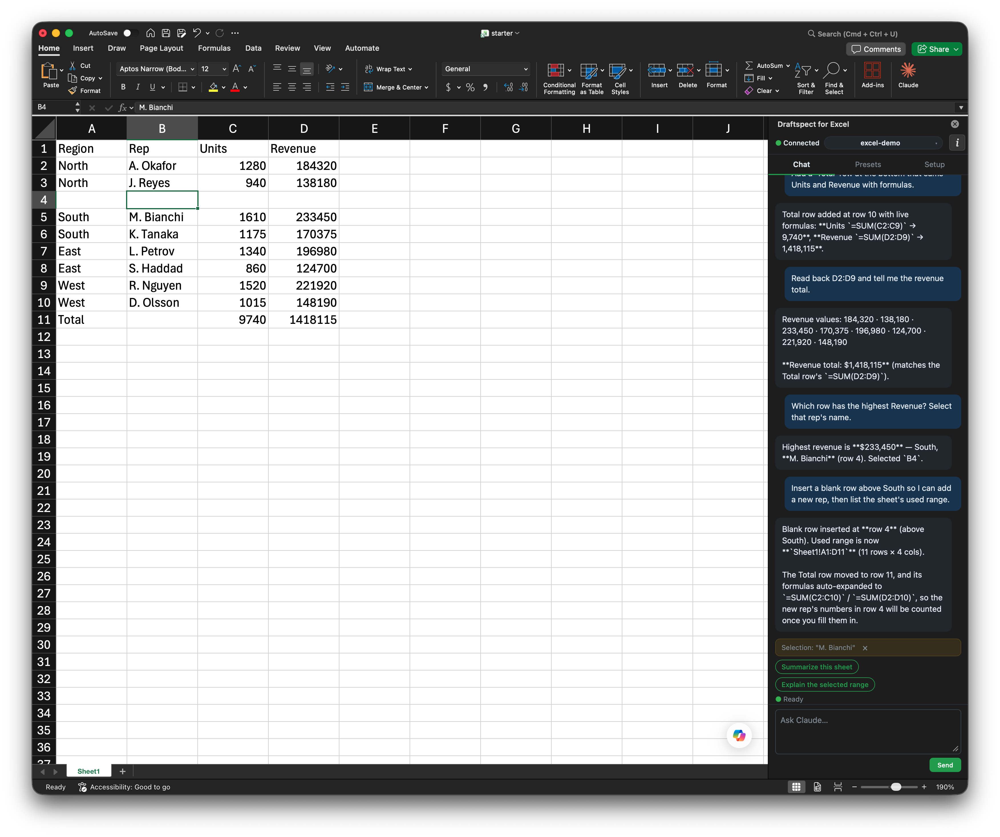

# Draftspect

> Add-ins for Word and Excel — **Powered by Claude.**

[](https://github.com/LeonardHope/Draftspect-Add-Ins-for-Word-and-Excel-Powered-by-Claude-Code/actions/workflows/ci.yml)
[](LICENSE)

Open Word or Excel, click a button, and chat with **your own local Claude Code** — the same agent, with the same MCP servers, subagents, skills, hooks, and `CLAUDE.md` you already use in the terminal — now able to read and edit the active document, leave comments, and write cells and formulas.

**The point of difference: local context.** Point Claude at any folders or files on your machine — a notes folder, prior drafts, a vendor's spec PDF, last quarter's data export, a code repo — and they become background it reads on demand while it works in your document. It's your real Claude Code, so everything you've configured applies.

## How Draftspect differs from the official Claude for Word and Excel add-in

Anthropic ships a first-party **Claude for Word and Excel** add-in (Office store / Microsoft Marketplace). It's polished, zero-setup, and first-party-supported. Draftspect is a different tool with a different tradeoff — heavier to set up, but it's _your_ local Claude Code with reach beyond Office:

|                        | Official Claude for Word/Excel                                                                                                                       | **Draftspect**                                                                                                                                                                                                   |
| ---------------------- | ---------------------------------------------------------------------------------------------------------------------------------------------------- | ---------------------------------------------------------------------------------------------------------------------------------------------------------------------------------------------------------------- |
| **Context it can use** | The Office documents you have **open**; you can attach other open Excel/PowerPoint files; plus connectors & Skills configured in your Claude account | Anything on your machine — point it at **arbitrary local folders/files** (a notes dir, prior drafts, a spec, a repo). Read on demand via `Read`/`Glob`/`Grep`/`Bash`, whether or not it's an Office file or open |
| **Whose Claude**       | A standalone Claude experience                                                                                                                       | **Your configured Claude Code** — your MCP servers, subagents, hooks, skills, slash commands, `CLAUDE.md` all apply                                                                                              |
| **The code**           | Closed, first-party                                                                                                                                  | **Open and user-modifiable** — clone it and change the task-pane UI, tools, presets, or system prompt to fit how you work                                                                                        |
| **Auth**               | Your Claude account                                                                                                                                  | Your local Claude Code OAuth **or** a plain `ANTHROPIC_API_KEY`                                                                                                                                                  |
| **Setup & support**    | Zero-setup, first-party-supported                                                                                                                    | Install Claude Code, run a tray app, sideload the add-in. macOS-primary; Windows newer. Single-user local tool, not a hardened service                                                                           |

Short version: if you want zero-setup and don't need machine-local context, the official add-in is the easy choice. Draftspect exists for when you want the document work to draw on **your own files and your own configured agent**.

> Both send the document content the model needs to Anthropic's API to get a response (any cloud LLM must — the model has to see it). Draftspect's difference is _where the orchestration, file access, and tool execution happen_ (locally, via your Claude Code), not a different data-handling claim.

## What it looks like

Two snapshots below — but the side pane is a full conversational agent, so what it _does_ is whatever you ask of the document, not a fixed set of buttons.

**Word** — _shown:_ surgical, tracked edits with margin comments. It also rewrites sections, inserts content, sweeps for issues and highlights them by severity, and answers from your context files — every change reviewable as a tracked change.



**Excel** — _shown:_ a range written with a live `=SUM()` total row. It also reads and explains ranges, finds and selects cells, inserts/deletes rows, and works across sheets — all from the same chat, with formulas written as formulas (not baked-in numbers).



---

## Status

Single-user tool you run on your own machine — intentionally scoped, not a hardened multi-tenant service (see [Security & privacy](#security--privacy)). Development was done on a Mac; Windows has had only limited testing in a Parallels VM. macOS is the primary, most-polished platform; Windows works but is less exercised.

- **Word** — the more mature surface.
- **Excel** — newer; the tools work, the UX trails Word slightly.

---

## What you can ask it to do

Open your document, click the add-in, and try things like:

- _"Summarize this contract in plain English."_
- _"Improve the writing in the selection. Use track changes."_
- _"Add a Total row with `=SUM()` formulas and read back the revenue total."_
- _"Review the Background section. Highlight anything weak in yellow and leave a comment explaining why."_

The asks that set Draftspect apart are the ones that pull in **local context** — folders or files you add in the Setup tab become background the agent reads on demand:

- _"Compare this draft against my `~/Notes` folder and tell me what's missing."_
- _"Rewrite the Methodology section using the terminology in `~/Research/glossary.md`."_
- _"Cross-check every figure in this paper against the data in `~/Project/results/`."_
- _"Fill this sheet from the assumptions in last quarter's deck (added as a context file)."_

Because it's your local Claude Code, anything you've configured — custom subagents, MCP servers, your `CLAUDE.md` files, hooks, skills — still applies.

---

## Prerequisites

Get these in place **before** you launch the app:

| Requirement                     | How to check / get it                                                                                                                                                                            |
| ------------------------------- | ------------------------------------------------------------------------------------------------------------------------------------------------------------------------------------------------ |
| **macOS** _or_ Windows 10/11    | (other platforms won't load the manifests)                                                                                                                                                       |
| **Node.js 18+**                 | `node --version` — [nodejs.org](https://nodejs.org/) or [Volta](https://volta.sh/) / [nvm](https://github.com/nvm-sh/nvm)                                                                        |
| **Microsoft Word and/or Excel** | Microsoft 365, Office 2019, or 2021. Word needs **WordApi 1.4+**, Excel **ExcelApi 1.4+** (any reasonably recent build; the manifests reject older).                                             |
| **Claude Code, signed in**      | `claude` in a terminal. Sign in once (Pro/Max works) and the daemon picks up your OAuth from the system keychain. **Or** export `ANTHROPIC_API_KEY=sk-ant-...` before launch (takes precedence). |
| **Git**                         | for cloning the repo                                                                                                                                                                             |

If you don't have Claude Code yet, [install it](https://docs.claude.com/en/docs/claude-code/overview) first. Draftspect is a thin layer on top of it — without it, nothing connects.

---

## Install

```bash
git clone https://github.com/LeonardHope/Draftspect-Add-Ins-for-Word-and-Excel-Powered-by-Claude-Code.git
cd Draftspect-Add-Ins-for-Word-and-Excel-Powered-by-Claude-Code
npm install
npm start
```

A tray icon (menu bar on macOS, system tray on Windows) appears. First launch offers to **install the add-in into Word and Excel for you** — click _Install_.

**Fully quit and reopen Word/Excel** so Office picks up the manifest. Then open it:

- **macOS:** Insert → Add-ins → **Developer Add-ins** → _Draftspect for Word_ / _Draftspect for Excel_.
- **Windows:** auto-sideloaded via the `WEF\Developer` registry key — find it under **Insert → Add-ins** (or **Home → Add-ins**).

> **One install per host.** The manifests use fixed add-in `<Id>` GUIDs, so a single Word (or Excel) install can sideload only one copy at a time. To run two clones side by side, change the `<Id>` in one clone's `manifests/word.xml` / `excel.xml` to a fresh UUID.

> **Daemon-only debugging.** To see daemon output in the terminal, run `npm run dev` instead of `npm start` (skips the Electron shell).

---

## How it works

```
   ┌─ Your computer ────────────────────────────────────────┐
   │                                                        │
   │   Tray app  ─► Daemon ◄──WebSocket──► Task pane        │
   │   (Electron)   (Node)                 (in Word/Excel)  │
   │                  │                                     │
   │                  │ forwards MCP servers from           │
   │                  ▼ ~/.claude.json                      │
   │             Your other MCP servers                     │
   │             (Visio, Gmail, custom…)                    │
   └──────────────────┬─────────────────────────────────────┘
                      │
                      │ Claude Agent SDK (local OAuth or API key)
                      ▼
              ┌───────────────┐
              │ Anthropic API │
              └───────────────┘
```

Three pieces, all on your machine:

1. **Tray app** (Electron) — spawns and watches the daemon, installs/uninstalls the add-in, surfaces native file pickers.
2. **Daemon** (Node) — the engine. It embeds the **Claude Agent SDK** (`@anthropic-ai/claude-agent-sdk`), which runs your locally-installed Claude Code **headlessly** — the same agent loop a non-interactive `claude` session uses, driven by the SDK instead of a terminal. It registers the Office tools as an in-process MCP server, forwards every MCP server from your `~/.claude.json` into the session, and speaks a small WebSocket protocol to the task pane.
3. **Task pane** — the HTML panel Word/Excel show on the right. Office.js reads and edits the active document; it chats with the daemon over `ws://127.0.0.1:47823`.

**One message, end to end:** you type in the task pane → WebSocket → daemon → Agent SDK `query()` → your Claude Code reasons and calls tools → document-tool calls round-trip back over the WebSocket so the task pane executes them via Office.js in the live document → results stream into the chat. Filesystem / `Bash` / MCP tools run daemon-side exactly as in your terminal Claude Code; only the document tools hop to the task pane.

Each open document gets its **own** session (independent conversation, transcript, and workspace), so Word and Excel — and two Word docs at once — don't cross-talk.

The task pane and daemon both live on `localhost`. The WebSocket bridge requires a per-launch token; the HTTP server only accepts the task pane's own origin.

### Compatibility

The daemon talks to Claude Code **through the Agent SDK**, never by shelling out to `claude` flags — so internal CLI changes are absorbed by the SDK. The dependency is pinned (`@anthropic-ai/claude-agent-sdk`, specific minor in `package.json`); on a breaking SDK major, bump the pin and re-test rather than chasing CLI behavior. You do need a reasonably current Claude Code installed and signed in — that's what the SDK drives.

---

## Using the add-in

1. **Launch the tray app first** — Word/Excel won't connect until the daemon is up.
2. Open a document or workbook, then open the add-in panel (see [Install](#install) for where it appears).
3. The **workspace** is set automatically: it's the folder your open document lives in. Claude can already read **anything inside that folder** on demand; the workspace just determines which `CLAUDE.md` and conversation history apply. Use **Change workspace** (Setup tab) to override — it holds until you open a document in a different folder.
4. **Add context files** for material **outside** the workspace folder — notes, prior drafts, a vendor's spec, a glossary, anywhere on disk. Setup tab → Context files → **+ Add file** / **+ Add folder**, with an optional one-line description so Claude knows when to consult it. Entries are saved into the workspace's `CLAUDE.md` and read on demand via `Read`/`Glob`/`Grep`. (Files _inside_ the workspace don't need adding — Claude reaches them already.)
5. Chat in the **Chat** tab. Pinned presets (chips above the input) are one-click prompts.

### Default presets

Presets are host-specific — Word and Excel each get their own set, editable in the **Presets** tab.

**Word**

| Preset                        | What it does                               |
| ----------------------------- | ------------------------------------------ |
| Summarize this document       | Read top-to-bottom, return a tight summary |
| Outline this document         | Heading outline + paragraph counts         |
| Improve writing in selection  | Tighten the selection, track changes on    |
| Fix typos and inconsistencies | Sweep + highlight + chat summary           |
| Simplify the selection        | Plain-language rewrite, track changes      |
| Add comments on this section  | Review-mode pass, no text edits            |
| Answer using my context files | Use the folders/files you've added         |
| Clear highlighting            | Wipe every highlight in one click          |

**Excel**

| Preset                        | What it does                                         |
| ----------------------------- | ---------------------------------------------------- |
| Summarize this sheet          | List sheets, read the used range, summarize          |
| Explain the selected range    | What the selection contains and any pattern          |
| Add a totals row              | Labelled Total row with `=SUM()` formulas            |
| Check the data for problems   | Blanks, inconsistencies, dupes — listed, not changed |
| Find a value                  | `excel_find_value` over a query                      |
| Answer using my context files | Use the folders/files you've added                   |

### Settings (Setup tab → Preferences)

- **Track changes** (Word only) — Always / Modifications only / Never. "Always" is the safe default; every edit is reviewable.
- **Show diagnostics in chat** — session/tool/turn events. **Off by default** (quieter); turn on when debugging.

---

## What the agent can touch in your documents

### Word

Seventeen tools, all through Office.js (no filesystem mutation of the live `.docx`):

| Tool                              | Use it for                                              |
| --------------------------------- | ------------------------------------------------------- |
| `office_get_selection`            | The implicit subject of "this", "here", "the selection" |
| `office_read_paragraphs`          | Read by ID, heading section, or range                   |
| `office_get_document_text`        | Whole-document text + word/character counts             |
| `office_get_outline`              | The heading tree (id / level / text)                    |
| `office_insert_paragraphs`        | Add new content after a paragraph or heading            |
| `office_replace_paragraphs`       | Whole-paragraph rewrites, 1-to-1                        |
| `office_replace_section`          | Find a heading, replace its section                     |
| `office_replace_text`             | Surgical sub-paragraph search/replace                   |
| `office_apply_style`              | Restyle existing paragraphs in place                    |
| `office_set_font`                 | Bold / italic / underline, size, color, font name       |
| `office_set_paragraph_formatting` | Alignment, indent, spacing                              |
| `office_insert_table`             | Append a table, or insert one after a paragraph         |
| `office_set_table_cell`           | Overwrite a cell in an existing table                   |
| `office_highlight`                | Color-coded by severity: error/warning/info/uncertain   |
| `office_clear_highlights`         | By paragraph, section, or all                           |
| `office_add_comment`              | Anchored on a paragraph or specific text                |
| `office_clear_comments`           | By paragraph, section, or all                           |

Every write tool respects your track-changes setting.

### Excel

Sixteen tools, A1 notation, 2D arrays:

| Tool                                                            | Use it for                                            |
| --------------------------------------------------------------- | ----------------------------------------------------- |
| `excel_get_selected_range`                                      | The implicit subject of "these cells"                 |
| `excel_list_sheets`                                             | Worksheet inventory + used ranges                     |
| `excel_read_range`                                              | Read a range or a whole sheet's used range            |
| `excel_write_range`                                             | Write a 2D values array (shape-checked)               |
| `excel_write_formula`                                           | Write a 2D array of formulas (e.g. `=SUM(A1:A9)`)     |
| `excel_set_format`                                              | Number format, font, fill, borders                    |
| `excel_find_value`                                              | Substring / whole-cell match across one or all sheets |
| `excel_insert_rows` / `excel_delete_rows`                       | 1-based row indices                                   |
| `excel_insert_columns` / `excel_delete_columns`                 | Column-letter addressed                               |
| `excel_clear_range`                                             | Clear contents, formats, or both                      |
| `excel_add_sheet` / `excel_delete_sheet` / `excel_rename_sheet` | Worksheet management                                  |
| `excel_select_range`                                            | Select a cell/range and switch to its sheet           |

### What the agent will refuse

- **Filesystem writes to the live document.** A permission guard refuses `Write`/`Edit`/`MultiEdit` against `.docx`/`.docm`/`.xlsx`/`.xlsm` paths, and `Bash` commands that mutate one in place (a redirection into an Office path, or `rm`/`mv`/`cp`/`tee`/`sed -i`/etc. against one). Reading is allowed — the agent legitimately does `unzip -p draft.docx …`, `cat`, or `git log -- report.docx`. Office holds the document open with unsaved changes; a filesystem write would corrupt it, so the agent uses the in-host tools instead. This is an **accident guard, not a security boundary**: it's heuristic and a determined agent can work around it (see [Security & privacy](#security--privacy)).

---

## Make it yours

Draftspect is a clone-and-run repo — the code is yours to modify:

- **Task-pane UI** — `taskpane/shared/taskpane.js` + `styles.css` + the per-host `index.html`. Change the layout, add a tab, restyle.
- **Presets** — edit the defaults in `taskpane/shared/taskpane.js` (`defaultWordPresets` / `defaultExcelPresets`), or just add/pin your own in the Presets tab at runtime.
- **Tools** — add a Word/Excel capability: a tool def in `daemon/office-tools.mjs` (zod schema) + an implementation in `taskpane/shared/tools-word.js` / `tools-excel.js` + a dispatch case.
- **Agent behavior** — the host-specific system prompts in `daemon/system-prompt.md`, `system-prompt-word.md`, `system-prompt-excel.md` are re-read every session start.

---

## Troubleshooting

<details>
<summary><strong>Task pane shows "Disconnected — retrying…"</strong></summary>

The daemon isn't running or crashed. Tray menu → **Open logs** (`~/.claude/office-addins/daemon.log`). The daemon auto-restarts up to 3 times before giving up.

</details>

<details>
<summary><strong>"Sign-in required" banner appears</strong></summary>

The Agent SDK couldn't authenticate. Either:

- Sign in to Claude Code: run `claude` in a terminal and follow the prompt.
- Or set `ANTHROPIC_API_KEY` in your shell and **relaunch** the tray app (the daemon reads env at boot).

Then quit the tray app and reopen it.

</details>

<details>
<summary><strong>An MCP server I configured isn't visible to the agent</strong></summary>

At daemon start the log shows `Loaded N MCP server(s) from ~/.claude.json: …`. The SDK silently drops any server whose initial handshake fails — restart the daemon (tray menu → **Restart daemon**) once it's back up. `~/.claude.json` is read **once at daemon boot**; changes need a daemon restart.

</details>

<details>
<summary><strong>The workspace is the wrong folder</strong></summary>

The workspace follows the open document's folder automatically. If it's wrong, the document is likely cloud-hosted (SharePoint/OneDrive — no local path), or you explicitly picked a different folder earlier. Use **Change workspace** in the Setup tab to set it; that choice holds until you open a document in a different folder.

</details>

<details>
<summary><strong>Auto-install of the add-in didn't work</strong></summary>

Manual fallback: in Word/Excel, **Insert → Add-ins → Manage My Add-ins → Upload My Add-in**, point at the file in `manifests/`. If that's missing on your build:

- **macOS:** copy `manifests/word.xml` to `~/Library/Containers/com.microsoft.Word/Data/Documents/wef/` (create the folder if missing). Same for Excel.
- **Windows:** add a `REG_SZ` value under `HKCU\Software\Microsoft\Office\16.0\WEF\Developer` whose **name and data are the manifest's full path**, then restart Office. (A Trusted Add-in Catalog also works but requires a real UNC network share — a local path is silently ignored.)

</details>

<details>
<summary><strong>The add-in icon is blank in the gallery (macOS)</strong></summary>

Cosmetic. macOS Office often won't fetch an `http://127.0.0.1` icon for the gallery tile; the add-in itself works regardless. (A fix needs the icon served over HTTPS, deferred.)

</details>

<details>
<summary><strong>Context-file changes don't seem to take effect</strong></summary>

Saving a context entry restarts the agent session (conversation preserved via `resume`) so the new `CLAUDE.md` loads. If you don't see the change, confirm you're on the right workspace — the topbar chip shows the active one.

</details>

---

## Authentication & distribution

The daemon authenticates via the Claude Agent SDK, which reads your **Claude Code OAuth credential** from the system keychain by default. Signed in to a Claude Pro/Max account? It just works. To use an API key instead:

```bash
export ANTHROPIC_API_KEY=sk-ant-...
npm start
```

The SDK prefers `ANTHROPIC_API_KEY` over keychain OAuth when present.

> **Distribution note.** This repo is open source — each user clones and runs it on their own machine with their own auth. That use is sanctioned. Shipping a hosted/packaged product that uses Anthropic subscription OAuth on behalf of users requires partner approval; see the [Agent SDK overview](https://docs.claude.com/en/api/agent-sdk/overview). If this ever becomes a product, expect to switch to BYO-API-key.

---

## Security & privacy

A single-user tool you run on your own machine — threat model is "your own machine, your own documents," not a hardened service. Worth knowing:

- **The `.docx`/`.xlsx` filesystem-write denial is an accident guard, not a security boundary.** It's regex-based; a determined agent can bypass it (string-built paths, decoded payloads). It stops _accidental_ overwrites of an open Office file, not a hostile agent. Edit Office files through the `office_*` / `excel_*` tools.
- **The local bridge is loopback-only and token-gated, but trusts every process running as you.** The WebSocket binds `127.0.0.1` and needs a per-daemon token; CORS blocks browser cross-origin reads, but any local process running as your user can read the token. No protection against a malicious local process — out of scope for a personal tool.
- **Conversation transcripts persist to disk, unredacted.** The Agent SDK writes each session's full transcript — including tool inputs and outputs, which can contain document text and the contents of any local or context files the agent read — to `~/.claude/projects/<hash>/<session_id>.jsonl`, exactly as terminal Claude Code does. `daemon.log` (plaintext of every chat message, tray → Open logs) is only the surface. Treat both `~/.claude/office-addins/daemon.log` and `~/.claude/projects/` as sensitive; delete to scrub history.
- **The tool writes into your workspace and `~/.claude`.** Adding a context file records it as a `CONTEXT-FILES` block in that workspace's `CLAUDE.md` (paths only — relative when the entry is inside the workspace); workspace/session bookkeeping lives in `~/.claude/office-addins/sessions.json`. Nothing else in your folders is modified except through the document tools.
- **Document content goes to Anthropic's API.** To answer, the model must see the relevant document text (and any context files it reads) — those are sent to the Anthropic API via the Agent SDK, the same trust boundary as using Claude Code in your terminal. Orchestration, file access, and tool execution stay local.

---

## Developing

### File layout

```
.
├── app/
│   ├── main.mjs           Electron tray shell; spawns + watches daemon
│   ├── sideload.mjs       Add-in install/uninstall (mac wef/, win WEF\Developer)
│   └── tray-icon.png
├── daemon/
│   ├── index.mjs          Agent SDK loop, permission handler, per-doc sessions
│   ├── bridge.mjs         WebSocket server + per-pane tool-call protocol
│   ├── office-tools.mjs   Word + Excel tool defs (zod schemas)
│   ├── workspace.mjs      Workspace = the document's own folder
│   ├── context.mjs        Per-workspace context-file block in CLAUDE.md
│   ├── sessions.mjs       Per-(host, workspace) session-id persistence
│   ├── diag.mjs           Opt-in [diag] logger (CC_OFFICE_DEBUG=1)
│   └── system-prompt*.md  Shared + per-host system prompt
├── taskpane/
│   ├── shared/{taskpane.js, tools-word.js, tools-excel.js, paths.js, styles.css}
│   ├── word/index.html, excel/index.html
│   └── icon-{32,64}.png   Add-in icons (regen via scripts/build-icons.py)
├── manifests/{word.xml, excel.xml}
├── examples/{word-demo, excel-demo}/   Ready-to-run demo workspaces
├── scripts/build-icons.py
├── tests/{workspace,context,sessions,bridge}.test.mjs
├── .github/workflows/ci.yml
├── package.json
└── README.md
```

### Tests

Pure-logic modules have unit tests (no Office.js, no SDK):

```bash
npm test
```

`node:test` runs all of `tests/*.test.mjs`. CI runs the same suite on Node 20.x and 22.x against every PR, plus prettier and an `npm audit`.

### Conventions

- Feature branches + PRs; nothing direct to `main`. CI green before merge.
- Don't bypass the filesystem-write guard on Office files — it protects unsaved work.
- The product name is **Draftspect** ("Powered by Claude"). Accurate references to the user's real **Claude Code** (install, sign-in, OAuth, the SDK driving it) stay as "Claude Code" — that's correct nominative use.

---

## License

MIT. See [LICENSE](LICENSE).
